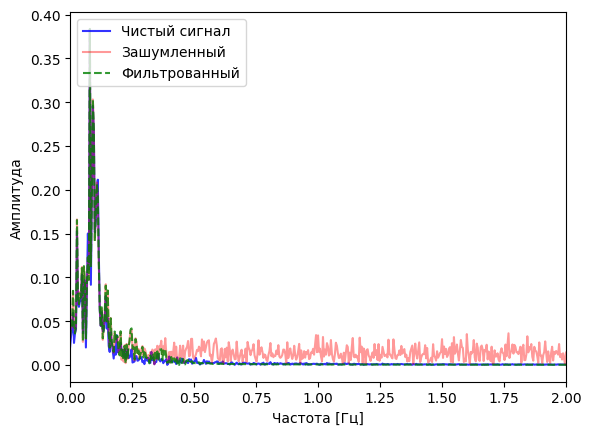

# Time Series Filtering and Forecasting Project

This project addresses the task of filtering noisy time series data and subsequently forecasting the underlying true signal using an LSTM neural network. Raw data:

## Description

The project workflow consists of the following key steps:

1.  **Data Loading and Preprocessing:** Training (`train_t.csv`) and testing (`test_t.csv`) time series data are loaded along with their corresponding ground truth signals (`etalon_for_train_t.csv`, `etalon_for_test_t.csv`). Each individual time series realization is normalized independently.

3.  **Data Analysis:** Visual inspection of several time series realizations and their frequency spectra (using FFT) is performed to understand the data characteristics.

5.  **Filter Design and Application:** Based on spectral analysis indicating the signal's main frequency content, a low-pass Butterworth filter is designed and applied to all training and testing data to reduce high-frequency noise.

6.  **Modeling (LSTM):** An LSTM neural network model is constructed and trained to predict the next value in the time series based on a sequence of previous values.

7.  **Model Evaluation:** The trained model is evaluated on the test set using common regression metrics: Mean Squared Error (MSE), Mean Absolute Error (MAE), and R-squared (R2).
   Without filter:
   

   With filter:
   

## Project Structure

*   `notebook.ipynb`: Main Jupyter Notebook containing the project code.
*   `README.md`: This file.

## Libraries Used

*   `pandas`
*   `numpy`
*   `scikit-learn`
*   `torch` (PyTorch)
*   `matplotlib`
*   `scipy`
*   `tqdm`

## Key Findings & Results

*   **Spectral Analysis:** FFT analysis revealed that the primary signal content is concentrated in frequencies below approximately 0.5 Hz.
*   **Filtering Effectiveness:** Applying a low-pass Butterworth filter significantly improved the signal-to-noise ratio, making the underlying signal much clearer.
*   **Model Performance:** An LSTM model trained on the *noisy* data showed poor forecasting performance. However, training the *same LSTM model architecture* on the *filtered* data resulted in a substantial improvement in forecasting accuracy on the test set.

## How to Run

1.  Ensure all required libraries are installed (see "Libraries Used" section).
2.  Open the `notebook.ipynb` file in Jupyter Notebook or Google Colab.
3.  Execute the cells sequentially.

---
